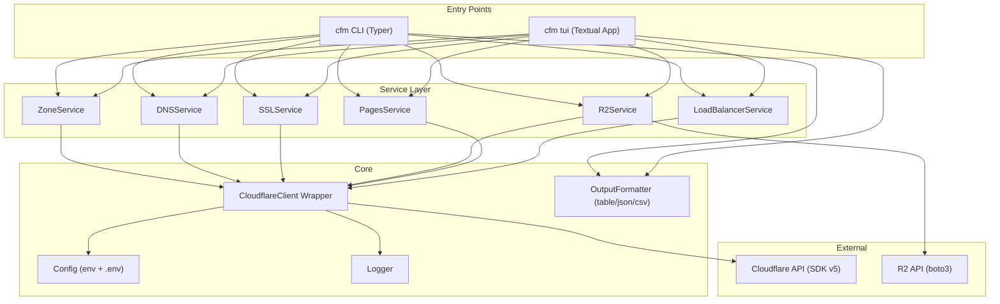

# CFManager — Cloudflare Management CLI & TUI Implementation Plan

A Python application providing both a rich Textual TUI dashboard and a Typer-based CLI for managing Cloudflare infrastructure. Designed for DevOps engineers and sysadmins who want a fast, keyboard-driven alternative to the Cloudflare web dashboard.

## Design Decisions Summary

| Decision | Choice |
|----------|--------|
| **Interfaces** | Textual TUI (primary) + Typer CLI (scripting) |
| **Auth** | API Token only (`CLOUDFLARE_API_TOKEN` env var + `.env` file) |
| **Account ID** | Auto-detected from token at startup (`client.accounts.list()`) |
| **SDK** | `cloudflare` official SDK v5+ (sync + async) |
| **CLI Framework** | Typer with Rich output |
| **TUI Framework** | Textual v8+ |
| **Python** | 3.12+ |
| **Package Manager** | `uv` |
| **Testing** | pytest + mocked API responses |
| **Theme** | Dark with Cloudflare orange (#F6821F) accent |
| **CLI Name** | `cfm` (entry point), package: `cfmanager` |
| **Distribution** | GitHub Releases + Windows `.exe` (PyInstaller) |
| **Output** | Rich tables (default) + `--json` + `--csv` flags |
| **Logging** | User-friendly errors + `--verbose` + log file |

---

## Proposed Architecture



### Project Structure

```
cfmanager/
├── pyproject.toml              # uv project config, dependencies, entry points
├── uv.lock                     # Lock file
├── README.md
├── LICENSE
├── .env.example                # Template for API token
├── .gitignore
│
├── src/
│   └── cfmanager/
│       ├── __init__.py         # Package version
│       ├── __main__.py         # python -m cfmanager support
│       │
│       ├── core/               # Shared infrastructure
│       │   ├── __init__.py
│       │   ├── client.py       # Cloudflare SDK wrapper (sync + async) & Account ID auto-detect
│       │   ├── config.py       # Env var + .env loading
│       │   ├── logger.py       # Logging setup
│       │   ├── exceptions.py   # Custom exception hierarchy
│       │   └── output.py       # OutputFormatter (table/json/csv)
│       │
│       ├── services/           # Business logic layer
│       │   ├── __init__.py
│       │   ├── zones.py        # Zone/domain management
│       │   ├── dns.py          # DNS record CRUD
│       │   ├── ssl.py          # SSL/TLS settings
│       │   ├── r2.py           # R2 bucket & object management (uses boto3 for objects)
│       │   ├── pages.py        # Pages project management
│       │   └── loadbalancers.py # Load balancer management
│       │
│       ├── cli/                # Typer CLI commands
│       │   ├── __init__.py
│       │   ├── app.py          # Root Typer app + global options
│       │   ├── zones.py        # cfm zones [list|get|create|delete]
│       │   ├── dns.py          # cfm dns [list|create|edit|delete]
│       │   ├── ssl.py          # cfm ssl [status|settings]
│       │   ├── r2.py           # cfm r2 [list|create|delete|objects]
│       │   ├── pages.py        # cfm pages [list|create|deploy]
│       │   └── loadbalancers.py # cfm lb [list|create|edit|delete]
│       │
│       └── tui/                # Textual TUI
│           ├── __init__.py
│           ├── app.py          # Main Textual App class
│           ├── theme.tcss      # Cloudflare dark theme CSS
│           ├── screens/        # Screen definitions
│           │   ├── __init__.py
│           │   ├── dashboard.py    # Home/overview screen
│           │   ├── zones.py        # Zone management screen
│           │   ├── dns.py          # DNS management screen
│           │   ├── ssl.py          # SSL settings screen
│           │   ├── r2.py           # R2 management and object browser screen
│           │   ├── pages.py        # Pages management screen
│           │   └── loadbalancers.py # LB management screen
│           ├── widgets/        # Reusable TUI widgets
│           │   ├── __init__.py
│           │   ├── sidebar.py      # Navigation sidebar
│           │   ├── status_bar.py   # Connection/account status
│           │   ├── data_table.py   # Enhanced DataTable with filtering
│           │   └── dialogs.py      # Confirm/edit modal dialogs
│           └── commands.py     # Command palette providers
│
├── tests/
│   ├── conftest.py             # Shared fixtures, mock factory
│   ├── fixtures/               # Mock API response JSON files
│   │   ├── zones.json
│   │   ├── dns_records.json
│   │   └── ...
│   ├── test_services/
│   │   ├── test_zones.py
│   │   ├── test_dns.py
│   │   └── ...
│   ├── test_cli/
│   │   ├── test_zones_cli.py
│   │   └── ...
│   └── test_tui/
│       └── test_app.py         # Textual pilot-based tests
│
└── scripts/
    └── build_exe.py            # PyInstaller build script
```

---

## Phase 1: Core Foundation — Project Setup + DNS + Zones [Completed]

### 1.1 Project Setup [Completed]
- Setup `pyproject.toml` using `uv` with dependencies: `cloudflare`, `textual`, `typer`, `rich`, `python-dotenv`.
- Configure entry point: `cfm = "cfmanager.cli.app:app"`.

### 1.2 Core Infrastructure [Completed]
- `config.py`: Environment variable and `.env` loading.
- `client.py`: Auto-detect `account_id` via `client.accounts.list()` at startup. Setup `Cloudflare` and `AsyncCloudflare`.
- `exceptions.py`: Custom error handling classes (`CFManagerError`, etc.).
- `logger.py`: Setup user-friendly output + verbose debugging log (`~/.cfmanager/cfmanager.log`).
- `output.py`: Rich Table, JSON, and CSV formatters.

### 1.3 Services — Zones & DNS [Completed]
- `ZoneService` for Zone listing, getting, caching, and purging.
- `DNSService` for DNS Record CRUD, supporting validation.

### 1.4 CLI & TUI Integration [Completed]
- `app.py`: CLI wrapper featuring `--verbose`, `--output`, and subcommand loading.
- `app.py` (TUI): Dash-style sidebar + main content panel using `theme.tcss`.
- Screens/Views for Zones and DNS in TUI.

---

## Phase 2: Expand — SSL + R2 + Pages [Pending]

### 2.1 SSL/TLS [Pending]
- View status, certificates, and modify SSL mode (flexible/full/strict) in CLI and TUI.

### 2.2 R2 Storage (with Objects) [Pending]
- `boto3` integrated for data/object operations.
- Bucket management (create, delete, list).
- Basic object browsing, uploading, and deleting in both CLI (`cfm r2 objects ...`) and TUI.

### 2.3 Pages [Pending]
- Project management, deployments listing, and rollback functionality.

---

## Phase 3: Advanced — Load Balancers + Packaging + Polish [Pending]

### 3.1 Load Balancers [Pending]
- CRUD for Load Balancers and Pools. Health checks visualization (origins status).

### 3.2 Packaging [Pending]
- Standalone `.exe` via PyInstaller.
- GitHub Actions workflow for building binaries (Windows, Linux, macOS).

### 3.3 UX Polish [Pending]
- Command palette fuzzy searching, loading states, and inline DataTable editing.

---

## Verification Plan

### Automated Tests
- `pytest` with mocked HTTP interactions (`respx` and `pytest-asyncio`).

### Manual Verification
- Testing CLI and TUI against a real Cloudflare test zone.
- Validating standalone executable build.
